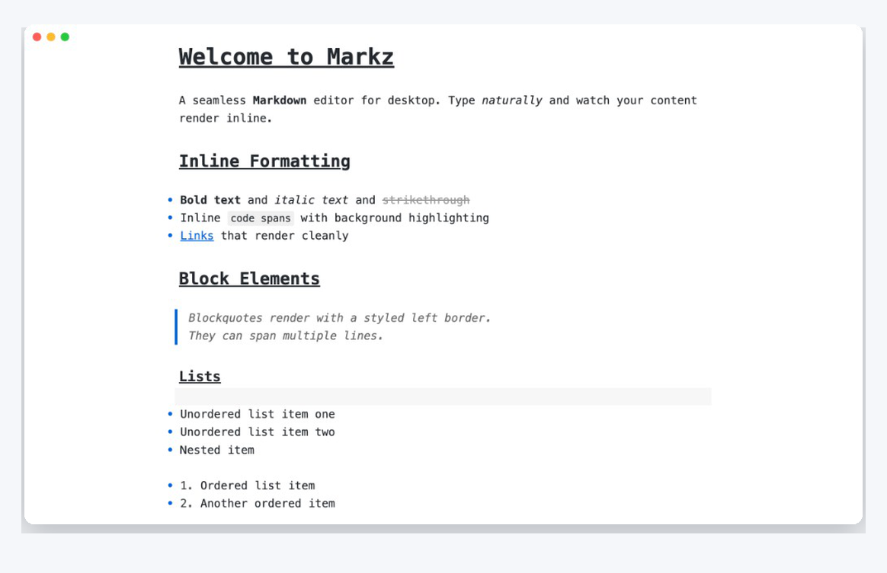
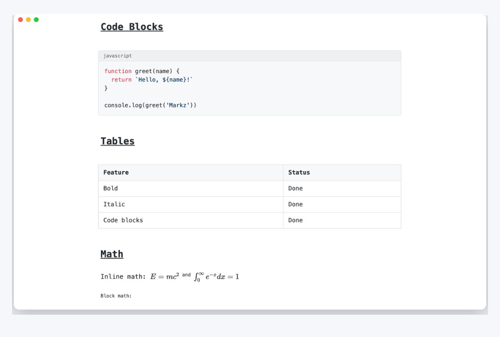
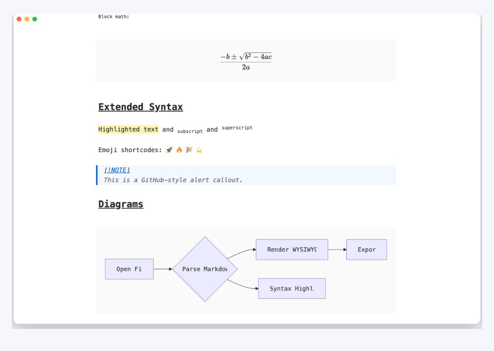

# Markz

A seamless, distraction-free WYSIWYG Markdown editor for desktop.

Markz removes the split between "editing" and "previewing". You write Markdown, and it renders inline as you type — what you see is what you mean.

**Status:** Beta — usable for daily writing. See [Release Notes](docs/RELEASE_NOTES.md) and [Changelog](CHANGELOG.md).

[](https://github.com/CodingTumbleweed/markz/releases/latest)

## Download

Pre-built installers for macOS, Windows, and Linux are available on **[GitHub Releases](https://github.com/CodingTumbleweed/markz/releases/latest)**.

| Platform | Download |
|----------|----------|
| macOS (Apple Silicon) | `Markz-*-arm64.dmg` |
| macOS (Intel) | `Markz-*-x64.dmg` |
| Windows | `Markz-Setup-*.exe` |
| Linux | `Markz-*.AppImage` or `markz_*_amd64.deb` |

Beta builds are **unsigned** — macOS Gatekeeper and Windows SmartScreen may warn on first launch. See the [installation guide](docs/INSTALL.md) for workarounds and checksum verification.

## Features

### Inline editing

Write Markdown naturally. Headings, emphasis, links, blockquotes, and lists render inline while you type.



### Code, tables, and math

Syntax-highlighted code blocks, GFM tables, and KaTeX math — block and inline — without a separate preview pane.



### Extended syntax and diagrams

Highlights, subscript/superscript, emoji, GitHub-style alerts, and Mermaid diagrams rendered in the editor.



## Development

### Prerequisites

- [Node.js](https://nodejs.org/) 20+
- npm 10+

### Run from source

```bash
git clone https://github.com/CodingTumbleweed/markz.git
cd markz
npm install
npm run dev
```

This builds the Electron main/preload processes, starts the Vite dev server, and opens the Markz window.

### Production build

```bash
npm run build
```

### Package installers

```bash
npm run package       # all platforms (on current OS)
npm run package:mac   # macOS (.dmg / .zip)
npm run package:win   # Windows (.exe)
npm run package:linux # Linux (.AppImage / .deb)
```

Installers are written to `release/`.

## Features

- **WYSIWYG Markdown editing** — cursor-aware inline rendering; no separate preview pane
- **Rich content** — KaTeX math, Mermaid diagrams, syntax-highlighted code blocks, tables
- **File management** — folder sidebar, Open Quickly (`Cmd+P`), recent files, auto-save
- **Editing UX** — focus mode, typewriter mode, source mode, command palette, spellcheck
- **Themes** — GitHub, Newsprint, and Minimal; light/dark/auto mode; preferences panel (`Cmd+,`)
- **Export** — PDF and HTML with YAML metadata, headers/footers, and server-side rendering
- **Cross-platform** — macOS, Windows, and Linux via Electron

## Keyboard shortcuts

| Action | macOS | Windows / Linux |
|--------|-------|-----------------|
| Bold | `Cmd+B` | `Ctrl+B` |
| Italic | `Cmd+I` | `Ctrl+I` |
| Link | `Cmd+K` | `Ctrl+K` |
| Open Quickly | `Cmd+P` | `Ctrl+P` |
| Command palette | `Cmd+Shift+P` | `Ctrl+Shift+P` |
| Preferences | `Cmd+,` | `Ctrl+,` |
| Source mode | `Cmd+/` | `Ctrl+/` |
| Export PDF | `Cmd+Shift+E` | `Ctrl+Shift+E` |

## Documentation

| Document | Description |
|----------|-------------|
| [Product Requirements (PRD)](docs/PRD.md) | Vision, target users, functional and non-functional requirements |
| [Technical Design](docs/DESIGN.md) | Architecture, tech stack, data flows, key subsystem designs |
| [Feature Specification](docs/FEATURE_SPEC.md) | Prioritized feature list organized by category |
| [Sprint Progress](docs/PROGRESS.md) | Sprint-by-sprint status tracker |
| [Installation Guide](docs/INSTALL.md) | Download, install, and upgrade instructions |
| [Release Notes](docs/RELEASE_NOTES.md) | User-facing highlights for each phase release |
| [Changelog](CHANGELOG.md) | All notable changes |
| [Security Policy](SECURITY.md) | Vulnerability reporting and supported versions |

## Tech stack

- **Electron 41** — cross-platform desktop shell
- **CodeMirror 6** — editor core with custom WYSIWYG decoration layer
- **KaTeX** — math rendering
- **Mermaid** — diagram rendering
- **highlight.js** — syntax highlighting
- **markdown-it** — export pipeline
- **Vite + esbuild + TypeScript** — build tooling

## License

MIT
