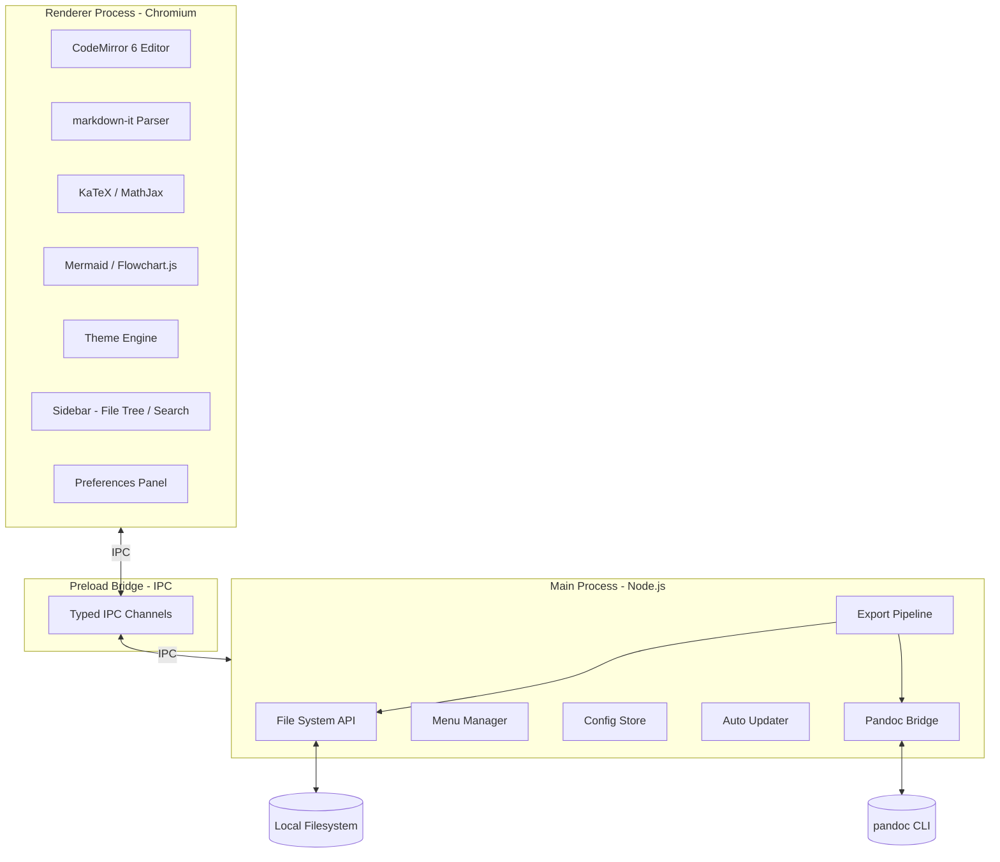
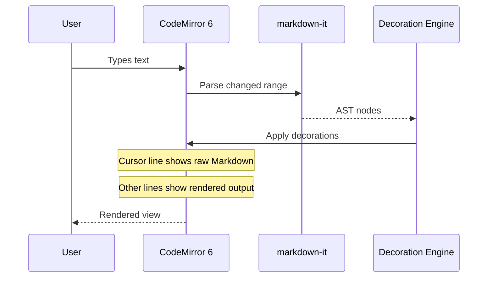
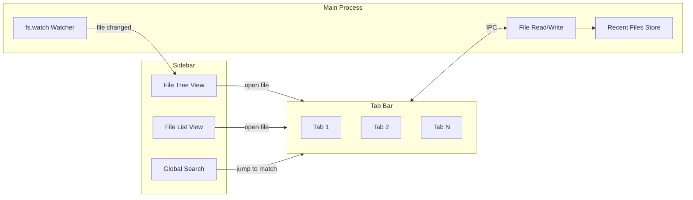
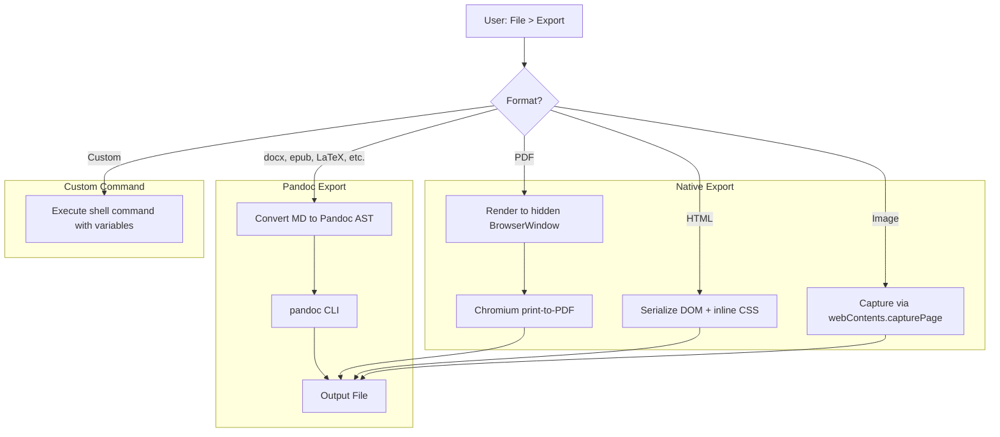
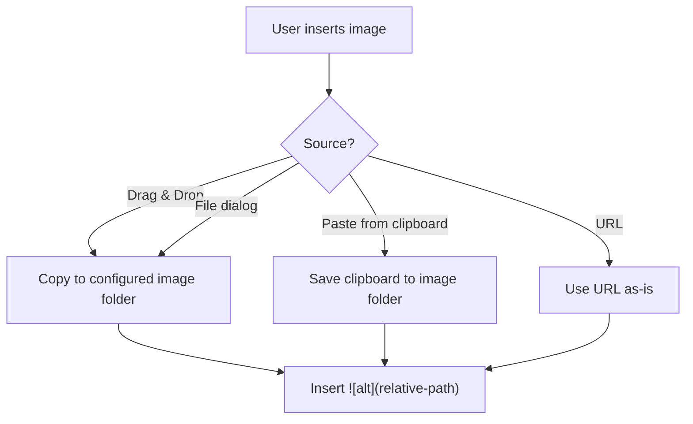

# Markz -- Technical Design Document

## 1. Architecture Overview

Markz is an Electron application with a clear separation between the **main process** (Node.js -- file I/O, system integration, menus, export) and the **renderer process** (Chromium -- editor UI, rendering, user interaction). Communication between the two uses Electron's IPC (Inter-Process Communication) via a typed preload bridge.



## 2. Tech Stack

| Layer | Technology | Rationale |
|-------|-----------|-----------|
| **Shell** | Electron 30+ | Cross-platform desktop, Chromium for rendering, Node.js for system access |
| **Language** | TypeScript (strict) | Type safety across main and renderer processes |
| **Editor core** | CodeMirror 6 | Modular, extensible, high-performance editor framework with decoration/widget APIs needed for inline rendering |
| **Markdown parser** | markdown-it + plugins | Fast, spec-compliant, pluggable CommonMark/GFM parser |
| **Math** | KaTeX (primary), MathJax (fallback) | KaTeX renders synchronously at ~100x MathJax speed; MathJax used for advanced features (physics, mhchem) |
| **Diagrams** | Mermaid, flowchart.js, js-sequence-diagrams | Industry-standard diagram libraries |
| **Syntax highlighting** | highlight.js or Lezer grammars (via CodeMirror) | 100+ language support |
| **State management** | Zustand or built-in CodeMirror state | Lightweight, no boilerplate |
| **UI framework** | Preact or vanilla DOM | Minimal overhead for sidebar, preferences, dialogs |
| **Build** | Vite (renderer), esbuild (main) | Fast HMR during development, tree-shaking for production |
| **Packaging** | electron-builder | Produces .dmg, .exe, .deb, .AppImage, .snap |
| **Testing** | Vitest (unit), Playwright (E2E) | Fast unit tests, real browser E2E |

## 3. Editor Design

The core design challenge is achieving a seamless editing experience where Markdown renders inline but expands to source at the cursor position.

### 3.1 Approach: CodeMirror 6 Decorations + Widgets

CodeMirror 6 provides two primitives that make this possible:

- **Replace decorations**: hide Markdown syntax tokens (e.g. `**`, `#`, `- [ ]`) and replace them with rendered output.
- **Widget decorations**: insert rendered elements (math blocks, diagrams, images, tables) inline in the document.

The editing flow:



### 3.2 Cursor-Aware Rendering

When the cursor enters a decorated region, the decoration is removed to reveal the raw Markdown source. When the cursor leaves, the decoration is re-applied. This is implemented via a CodeMirror `ViewPlugin` that listens to cursor position changes and adjusts the decoration set accordingly.

Key rules:
- The **active line** (or active block for multi-line constructs like tables, code blocks, math blocks) always shows raw Markdown.
- All other content renders as styled output.
- Transitions are instantaneous (no animation) to avoid lag perception.

### 3.3 Block-Level Rendering

For complex blocks (math, diagrams, code blocks, tables), the approach is:

| Block type | Rendering strategy |
|-----------|-------------------|
| Headings | Replace decoration: hide `#` markers, apply heading CSS |
| Bold/Italic/etc. | Replace decoration: hide syntax chars, apply inline styles |
| Code blocks | Widget: render highlighted code in a `<pre>` block; edit in a CodeMirror sub-editor |
| Math blocks | Widget: render via KaTeX/MathJax into a `<div>`; click-to-edit shows source in a textarea |
| Inline math | Replace decoration: render KaTeX inline |
| Diagrams | Widget: render Mermaid/flowchart.js SVG; click-to-edit reveals source |
| Tables | Widget: render HTML `<table>` with toolbar; click to edit cells directly |
| Images | Widget: render `` tag; click reveals `` source |
| Task lists | Replace decoration: render checkbox as `<input type="checkbox">` |
| Blockquotes | Replace decoration: style with left border, hide `>` markers |

## 4. File Management Subsystem



Design decisions:
- **File tree**: built from `fs.readdir` recursively, cached in memory, updated via `fs.watch`.
- **Tabs**: each tab holds a CodeMirror `EditorState`. Switching tabs swaps the state, not the editor instance, to preserve undo history.
- **Auto-save**: debounced write (default 5 seconds after last edit). Configurable in preferences.
- **External changes**: detected via `fs.watch`; user prompted to reload or keep their version.
- **Open Quickly**: fuzzy match over the file index using a fast string matching algorithm (e.g. fzf-style scoring).

## 5. Theme Engine

Themes are pure CSS files loaded into the renderer at runtime.

### 5.1 Loading Order

1. `base.css` -- Markz default styles (reset, layout, editor chrome).
2. `{theme}.css` -- the selected theme file from the `themes/` directory.
3. `base.user.css` -- user overrides applied to all themes (optional).
4. `{theme}.user.css` -- user overrides for a specific theme (optional).

### 5.2 Theme Directory

```
~/.markz/themes/
  github.css
  night.css
  newsprint.css
  base.user.css        (user-created, optional)
  github.user.css      (user-created, optional)
```

### 5.3 CSS Variables

Themes expose a standard set of CSS variables that components reference:

```css
:root {
  --markz-font-family: ...;
  --markz-font-size: ...;
  --markz-bg: ...;
  --markz-fg: ...;
  --markz-accent: ...;
  --markz-code-bg: ...;
  --markz-border: ...;
  --mermaid-theme: default;
  --sequence-theme: simple;
}
```

### 5.4 Dark Mode

The app detects the OS dark mode preference via `nativeTheme.shouldUseDarkColors`. The user can also override this in preferences. Light and dark themes can be configured independently.

## 6. Export Pipeline



### 6.1 PDF Export Details

- Render the document in a hidden `BrowserWindow` with the selected theme CSS applied.
- Use `webContents.printToPDF()` with configurable options: paper size, margins, landscape/portrait, header/footer text (with variable substitution), print background.
- Support page breaks via CSS `page-break-before` on top-level headings (configurable).
- Inject YAML front matter variables into header/footer templates.

### 6.2 Pandoc Integration

- Markz converts its internal Markdown into Pandoc's native AST format.
- This AST is piped to `pandoc` via stdin with the target format flag.
- The user configures extra Pandoc arguments, templates, and style references in the preferences panel.
- Pandoc path auto-detection with manual override in preferences.

## 7. Math Rendering

### 7.1 Dual-Engine Approach

| Scenario | Engine | Reason |
|----------|--------|--------|
| Inline math, simple block math | KaTeX | Synchronous rendering, ~100x faster, no layout reflow |
| mhchem, physics package, advanced macros | MathJax | Broader LaTeX coverage |

The engine selection is automatic: attempt KaTeX first; if it throws a parse error on an unsupported command, fall back to MathJax for that expression.

### 7.2 Auto-Numbering

Three modes:
1. **Off** -- no numbers; user can manually number with `\tag`.
2. **AMS rules** -- only numbered environments (`equation`, `align`, etc.) get numbers.
3. **All** -- every display math gets a sequential number.

State is tracked per-document. A `\label{...}` creates a reference target; `\ref{...}` resolves to the number.

## 8. Diagram Rendering

Diagrams are rendered in sandboxed containers to prevent script injection:

- **Mermaid**: rendered via `mermaid.render()` into an SVG string, inserted as a widget decoration.
- **flowchart.js / js-sequence-diagrams**: similar approach, rendered into SVG.
- Rendering is **debounced** (300ms after last keystroke in the code block) to avoid excessive redraws.
- Rendered diagrams support right-click context menu: Save as SVG/PNG/JPG, Copy as image.

Mermaid theming is controlled via CSS variables (`--mermaid-theme`) defined in the active theme CSS.

## 9. Image Handling

### 9.1 Insert Flow



### 9.2 Path Resolution

- Relative paths are resolved relative to the `.md` file's directory.
- `root-url` in YAML front matter overrides the base path for resolution.
- The image folder is configurable: same directory, `./assets/`, or a custom path.

## 10. Preferences System

Preferences are stored in `~/.markz/config.json` and loaded at startup.

### 10.1 Schema

```
{
  "general": {
    "language": "en",
    "autoSave": true,
    "autoSaveInterval": 5000,
    "launchBehavior": "restorePrevious" | "newFile" | "openFolder"
  },
  "appearance": {
    "theme": "github",
    "darkTheme": "night",
    "darkMode": "auto" | "light" | "dark",
    "fontSize": 16,
    "fontFamily": "default",
    "sidebarVisible": true,
    "outlineVisible": false
  },
  "editor": {
    "indentSize": 4,
    "indentWithTabs": false,
    "lineNumbers": false,
    "autoPair": true,
    "smartPunctuation": true,
    "typewriterMode": false,
    "focusMode": false,
    "wordWrap": true
  },
  "markdown": {
    "inlineMath": true,
    "subscript": false,
    "superscript": false,
    "highlight": false,
    "diagrams": true,
    "smartDashes": true,
    "defaultCodeLanguage": "",
    "mathAutoNumbering": "off" | "ams" | "all",
    "physicsPackage": false
  },
  "export": {
    "pdfPaperSize": "A4",
    "pdfMargin": { "top": 20, "bottom": 20, "left": 15, "right": 15 },
    "pdfHeader": "",
    "pdfFooter": "${pageNo} / ${pageCount}",
    "pandocPath": "auto",
    "defaultExportFolder": "auto",
    "items": [...]
  }
}
```

### 10.2 UI

The preferences panel is a modal window rendered in the renderer process, organized into tabs matching the schema sections. Changes are applied in real-time (no restart required) and synced to the main process via IPC.

## 11. Keyboard Shortcuts & Command Palette

### 11.1 Default Shortcuts

| Action | macOS | Windows/Linux |
|--------|-------|---------------|
| Bold | Cmd+B | Ctrl+B |
| Italic | Cmd+I | Ctrl+I |
| Heading 1-6 | Cmd+1..6 | Ctrl+1..6 |
| Code span | Cmd+Shift+` | Ctrl+Shift+` |
| Link | Cmd+K | Ctrl+K |
| Image | Cmd+Shift+I | Ctrl+Shift+I |
| Table | Cmd+Opt+T | Ctrl+Shift+T |
| Code block | Cmd+Opt+C | Ctrl+Shift+C |
| Math block | Cmd+Opt+M | Ctrl+Shift+M |
| Find | Cmd+F | Ctrl+F |
| Replace | Cmd+Opt+F | Ctrl+H |
| Open Quickly | Cmd+P | Ctrl+P |
| Command palette | Cmd+Shift+P | Ctrl+Shift+P |
| Toggle sidebar | Cmd+Shift+L | Ctrl+Shift+L |
| Toggle outline | Cmd+Shift+O | Ctrl+Shift+O |
| Toggle source mode | Cmd+/ | Ctrl+/ |
| Export to PDF | Cmd+Shift+E | Ctrl+Shift+E |
| Preferences | Cmd+, | Ctrl+, |

### 11.2 Command Palette

A VS Code-style command palette (`Cmd+Shift+P`) that allows fuzzy search over all available commands. This serves as the universal entry point for features that don't have dedicated shortcuts.

## 12. Project Structure

```
markz/
  src/
    main/                    # Electron main process
      index.ts               # Entry point, window management
      ipc.ts                 # IPC handler registration
      fileSystem.ts          # File read/write/watch operations
      export/                # Export pipeline
        pdf.ts
        html.ts
        image.ts
        pandoc.ts
        custom.ts
      menu.ts                # Application menu builder
      config.ts              # Config store (read/write JSON)
      updater.ts             # Auto-update logic
    renderer/                # Electron renderer process
      index.html
      index.ts               # Entry point
      editor/                # CodeMirror 6 editor setup
        setup.ts             # Editor configuration and extensions
        decorations.ts       # Inline rendering decoration engine
        widgets/             # Widget implementations
          math.ts
          diagram.ts
          table.ts
          image.ts
          codeBlock.ts
        keymap.ts            # Custom keybindings
      parser/                # markdown-it setup and plugins
        index.ts
        plugins/             # Custom markdown-it plugins
      sidebar/               # File tree, file list, search
        fileTree.ts
        fileList.ts
        search.ts
      preferences/           # Preferences panel UI
        index.ts
      theme/                 # Theme loader
        loader.ts
      components/            # Shared UI components
        commandPalette.ts
        tabBar.ts
        statusBar.ts
        dialog.ts
    preload/                 # Preload script (IPC bridge)
      index.ts
      api.ts                 # Typed API exposed to renderer
    shared/                  # Code shared between main and renderer
      types.ts               # Shared TypeScript types
      constants.ts
  themes/                    # Built-in theme CSS files
    github.css
    night.css
    newsprint.css
    whitey.css
  resources/                 # App icons, installer assets
  electron-builder.yml       # Packaging configuration
  package.json
  tsconfig.json
  vite.config.ts
```

## 13. Security Considerations

- **Context isolation**: enabled in all `BrowserWindow` instances. The renderer has no direct access to Node.js APIs.
- **Preload bridge**: only explicitly defined IPC channels are exposed via `contextBridge`.
- **Diagram sandboxing**: Mermaid and other diagram renderers run in the main renderer but produce only SVG output; no script execution from user content.
- **HTML sanitization**: inline HTML in Markdown is sanitized before rendering to prevent XSS.
- **External links**: opened in the system default browser, never in the Electron window.
- **YAML front matter**: variables used in export templates are escaped to prevent injection.

## 14. Performance Strategy

- **Incremental parsing**: only re-parse the changed range of the document, not the entire file.
- **Virtualized rendering**: CodeMirror 6 only renders visible lines; off-screen content is not in the DOM.
- **Debounced decoration updates**: decorations for expensive renders (math, diagrams) are updated after a short debounce.
- **Web Workers**: heavy parsing (large math expressions, complex diagrams) can be offloaded to a Web Worker.
- **Lazy loading**: Mermaid, MathJax, and other large libraries are loaded on first use, not at startup.
- **File index caching**: the file tree index is cached to disk and incrementally updated via `fs.watch`.
